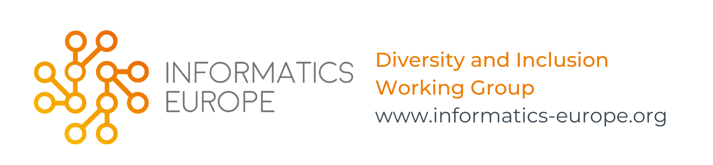

## Welcome to Diversity and Inclusion Working group at Informatics Europe

The Diversity and Inclusion Working Group (or IE EDI) is a part of [Informatics Europe](https://www.informatics-europe.org/), and a place to connect, exchange and cooperate with your European subject-matter experts.

The objective of this page is to gather ongoing EDI initiatives within Europe and experiences with these initiatives.

### Informatics Europe
The Voice of Informatics Research and Education in Europe. 

### How to participate?
Create a pull requests describing the initiative, intended audience, place, and experience.
For example, 

### Initiatives by IPN EDI - Netherlands

### Support or Contact

Having trouble with Pages? Check out our [documentation](https://docs.github.com/categories/github-pages-basics/) or [contact support](https://support.github.com/contact) and we’ll help you sort it out.
